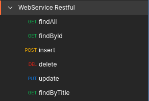

# Web services API Restful com MongoDB

## Modelo de domínio


> Trata-se de um projeto Web services com Java e Spring Boot no intuito de simular postagens e comentários

## Diagrama de objetos


### Pré-requisitos

Antes de começar, verifique se você atendeu aos seguintes requisitos:

* Você precisa compreender a linguagem Java, conceitos de POO (Encapsulamento, herança e polimorfismo)
* Você precisa compreender alguns projetos do ecossistema Spring
* Você precisa compreender o que é API Restful

### Tecnologias empregadas
- [x] Spring boot
- [x] Spring web
- [x] Spring data
- [x] Object Document Mapping (ODM)
- [x] API Restful
- [x] Banco de dados MongoDB

## Estrutura [Banco de dados MongoDB](https://www.mongodb.com/pt-br/what-is-mongodb)

Banco de dados totalmente contruído com **_ODM_**
#### Estrutura

#### Tabela de Usuários

#### Tabela de Posts


<center> 
    <b>Banco de dados orientado a agregados.<br>
</center>
<br>

### Comando linux  MongoDB:
- Ligar o banco: `` sudo service mongod start``
- Desligar o banco: `` sudo service mongod stop``

### Imagens API Restful no [Postman](https://en.wikipedia.org/wiki/Postman_(software))

#### Verbos


#### Post


#### Get


#### Put


#### Delete


Para instalar o projeto, siga estas etapas:

Linux, macOS e Windows:
```
<git clone git@github.com:AlissonWenceslau/workshop-spring-boot-mongodb.git >
```
#### Próximo passo
* Importe o projeto na IDE _**Spring Tools Suite**_, e execute a classe 
``
WorkshopmongoApplication.java
`` dentro da pasta `src/main/java/com/alissonwenceslau/workshopmongo` | [Acessar pasta](src/main/java/com/alissonwenceslau/workshopmongo).

###### Redes Sociais:
[](https://www.facebook.com/AlissonWenceslau/)
[](https://www.linkedin.com/in/alisson-wenceslau-b78b4aa3/Twitter)
[](https://twitter.com/AlissonWences)
